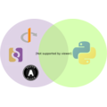

# Docker Icon Vault

A curated collection of icons for Docker official images.

## Icons

Total: **131 Docker images**

| Name | Icon | Description | URL |
|------|------|-------------|-----|
| memcached |  | Free & open source, high-performance, distributed memory object caching system. | `https://incari.github.io/docker-icon-vault/icons/memcached.png` |
| nginx |  | Official build of Nginx. | `https://incari.github.io/docker-icon-vault/icons/nginx.png` |
| busybox |  | Busybox base image. | `https://incari.github.io/docker-icon-vault/icons/busybox.png` |
| alpine |  | A minimal Docker image based on Alpine Linux with a complete package index and only 5 MB in size! | `https://incari.github.io/docker-icon-vault/icons/alpine.png` |
| redis |  | Redis is the world’s fastest data platform for caching, vector search, and NoSQL databases. | `https://incari.github.io/docker-icon-vault/icons/redis.png` |
| postgres |  | The PostgreSQL object-relational database system provides reliability and data integrity. | `https://incari.github.io/docker-icon-vault/icons/postgres.png` |
| ubuntu |  | Ubuntu is a Debian-based Linux operating system based on free software. | `https://incari.github.io/docker-icon-vault/icons/ubuntu.png` |
| python |  | Python is an interpreted, interactive, object-oriented, open-source programming language. | `https://incari.github.io/docker-icon-vault/icons/python.png` |
| node |  | Node.js is a JavaScript-based platform for server-side and networking applications. | `https://incari.github.io/docker-icon-vault/icons/node.png` |
| mysql |  | MySQL is a widely used, open-source relational database management system (RDBMS). | `https://incari.github.io/docker-icon-vault/icons/mysql.png` |
| mongo |  | MongoDB document databases provide high availability and easy scalability. | `https://incari.github.io/docker-icon-vault/icons/mongo.png` |
| httpd |  | The Apache HTTP Server Project | `https://incari.github.io/docker-icon-vault/icons/httpd.png` |
| rabbitmq |  | RabbitMQ is an open source multi-protocol messaging broker. | `https://incari.github.io/docker-icon-vault/icons/rabbitmq.png` |
| traefik |  | Traefik, The Cloud Native Edge Router | `https://incari.github.io/docker-icon-vault/icons/traefik.png` |
| docker |  | Docker in Docker! (commonly known as "dind") | `https://incari.github.io/docker-icon-vault/icons/docker.png` |
| hello-world |  | Hello World! (an example of minimal Dockerization) | `https://incari.github.io/docker-icon-vault/icons/hello-world.png` |
| mariadb |  | MariaDB Server is a high performing open source relational database, forked from MySQL. | `https://incari.github.io/docker-icon-vault/icons/mariadb.png` |
| openjdk |  | Pre-release / non-production builds of OpenJDK | `https://incari.github.io/docker-icon-vault/icons/openjdk.png` |
| golang |  | Go (golang) is a general purpose, higher-level, imperative programming language. | `https://incari.github.io/docker-icon-vault/icons/golang.png` |
| debian |  | Debian is a Linux distribution that's composed entirely of free and open-source software. | `https://incari.github.io/docker-icon-vault/icons/debian.png` |
| ruby |  | Ruby is a dynamic, reflective, object-oriented, general-purpose, open-source programming language. | `https://incari.github.io/docker-icon-vault/icons/ruby.png` |
| wordpress |  | The WordPress rich content management system can utilize plugins, widgets, and themes. | `https://incari.github.io/docker-icon-vault/icons/wordpress.png` |
| php |  | While designed for web development, the PHP scripting language also provides general-purpose use. | `https://incari.github.io/docker-icon-vault/icons/php.png` |
| sonarqube |  | Official images for SonarQube, code analysis tool for code quality and security | `https://incari.github.io/docker-icon-vault/icons/sonarqube.png` |
| haproxy |  | HAProxy - The Reliable, High Performance TCP/HTTP Load Balancer | `https://incari.github.io/docker-icon-vault/icons/haproxy.png` |
| influxdb |  | InfluxDB is the open source time series database built for real-time analytic workloads. | `https://incari.github.io/docker-icon-vault/icons/influxdb.png` |
| consul |  | Consul is a datacenter runtime that provides service discovery, configuration, and orchestration. | `https://incari.github.io/docker-icon-vault/icons/consul.png` |
| nextcloud |  | Nextcloud manual docker image | `https://incari.github.io/docker-icon-vault/icons/nextcloud.png` |
| amazonlinux |  | Amazon Linux provides a stable, secure, and high-performance execution environment for applications. | `https://incari.github.io/docker-icon-vault/icons/amazonlinux.png` |
| elasticsearch |  | Elasticsearch is a powerful open source search and analytics engine that makes data easy to explore. | `https://incari.github.io/docker-icon-vault/icons/elasticsearch.png` |
| tomcat |  | Apache Tomcat is an open source implementation of the Java Servlet and JavaServer Pages technologies | `https://incari.github.io/docker-icon-vault/icons/tomcat.png` |
| maven |  | Apache Maven is a software project management and comprehension tool. | `https://incari.github.io/docker-icon-vault/icons/maven.png` |
| caddy |  | Caddy 2 is a powerful, enterprise-ready, open source web server with automatic HTTPS written in Go. | `https://incari.github.io/docker-icon-vault/icons/caddy.png` |
| eclipse-mosquitto |  | Eclipse Mosquitto is an open source message broker which implements MQTT version 5, 3.1.1 and 3.1 | `https://incari.github.io/docker-icon-vault/icons/eclipse-mosquitto.png` |
| telegraf |  | Telegraf is an agent for collecting metrics and writing them to InfluxDB or other outputs. | `https://incari.github.io/docker-icon-vault/icons/telegraf.png` |
| vault |  | Vault is a tool for securely accessing secrets via a unified interface and tight access control. | `https://incari.github.io/docker-icon-vault/icons/vault.png` |
| bash |  | Bash is the GNU Project's Bourne Again SHell | `https://incari.github.io/docker-icon-vault/icons/bash.png` |
| adminer |  | Database management in a single PHP file. | `https://incari.github.io/docker-icon-vault/icons/adminer.png` |
| ghost |  | Publish by web and email newsletter, with member signups and subscription payments. | `https://incari.github.io/docker-icon-vault/icons/ghost.png` |
| solr |  | Solr is the blazing-fast, open source, multi-modal search platform built on Apache Lucene. | `https://incari.github.io/docker-icon-vault/icons/solr.png` |
| kong |  | The Cloud-Native API Gateway for APIs and Microservices | `https://incari.github.io/docker-icon-vault/icons/kong.png` |
| zookeeper |  | Apache ZooKeeper is an open-source server which enables highly reliable distributed coordination. | `https://incari.github.io/docker-icon-vault/icons/zookeeper.png` |
| neo4j |  | Neo4j is a highly scalable, robust native graph database. | `https://incari.github.io/docker-icon-vault/icons/neo4j.png` |
| gradle |  | Gradle is a fast, reliable, and flexible open-source build tool with an elegant, extensible DSL. | `https://incari.github.io/docker-icon-vault/icons/gradle.png` |
| perl |  | Perl is a high-level, general-purpose, interpreted, dynamic programming language. | `https://incari.github.io/docker-icon-vault/icons/perl.png` |
| buildpack-deps |  | A collection of common build dependencies used for installing various modules, e.g., gems. | `https://incari.github.io/docker-icon-vault/icons/buildpack-deps.png` |
| eclipse-temurin |  | Official Images for OpenJDK binaries built by Eclipse Temurin. | `https://incari.github.io/docker-icon-vault/icons/eclipse-temurin.png` |
| cassandra |  | Apache Cassandra is an open-source distributed storage system. | `https://incari.github.io/docker-icon-vault/icons/cassandra.png` |
| nats |  | NATS is an open-source, high-performance, cloud native messaging system. | `https://incari.github.io/docker-icon-vault/icons/nats.png` |
| kibana |  | Kibana gives shape to any kind of data — structured and unstructured — indexed in Elasticsearch. | `https://incari.github.io/docker-icon-vault/icons/kibana.png` |
| percona |  | Percona Server is a fork of the MySQL relational database management system created by Percona. | `https://incari.github.io/docker-icon-vault/icons/percona.png` |
| drupal |  | Drupal is an open source content management platform powering millions of websites and applications. | `https://incari.github.io/docker-icon-vault/icons/drupal.png` |
| composer |  | Composer is a dependency manager written in and for PHP. | `https://incari.github.io/docker-icon-vault/icons/composer.png` |
| logstash |  | Logstash is a tool for managing events and logs. | `https://incari.github.io/docker-icon-vault/icons/logstash.png` |
| couchdb |  | CouchDB is a database that uses JSON for documents, an HTTP API, & JavaScript/declarative indexing. | `https://incari.github.io/docker-icon-vault/icons/couchdb.png` |
| chronograf |  | Chronograf is a visualization tool for time series data in InfluxDB. | `https://incari.github.io/docker-icon-vault/icons/chronograf.png` |
| matomo |  | Matomo is the leading open-source analytics platform that gives you more than powerful analytics. | `https://incari.github.io/docker-icon-vault/icons/matomo.png` |
| fedora |  | Official Docker builds of Fedora | `https://incari.github.io/docker-icon-vault/icons/fedora.png` |
| amazoncorretto |  | Corretto is a no-cost, production-ready distribution of the Open Java Development Kit (OpenJDK). | `https://incari.github.io/docker-icon-vault/icons/amazoncorretto.png` |
| rust |  | Rust is a systems programming language focused on safety, speed, and concurrency. | `https://incari.github.io/docker-icon-vault/icons/rust.png` |
| flink |  | Apache Flink® is a powerful open-source distributed stream and batch processing framework. | `https://incari.github.io/docker-icon-vault/icons/flink.png` |
| couchbase |  | Couchbase Server is a NoSQL document database with a distributed architecture. | `https://incari.github.io/docker-icon-vault/icons/couchbase.png` |
| joomla |  | Joomla! is an open source content management system. | `https://incari.github.io/docker-icon-vault/icons/joomla.png` |
| phpmyadmin |  | phpMyAdmin - A web interface for MySQL and MariaDB. | `https://incari.github.io/docker-icon-vault/icons/phpmyadmin.png` |
| groovy |  | Apache Groovy is a multi-faceted language for the Java platform. | `https://incari.github.io/docker-icon-vault/icons/groovy.png` |
| rethinkdb |  | RethinkDB is an open-source, document database that makes it easy to build and scale realtime apps. | `https://incari.github.io/docker-icon-vault/icons/rethinkdb.png` |
| rocket.chat |  | The Complete Open Source Chat Solution | `https://incari.github.io/docker-icon-vault/icons/rocket.chat.png` |
| redmine |  | Redmine is a flexible project management web application written using Ruby on Rails framework | `https://incari.github.io/docker-icon-vault/icons/redmine.png` |
| erlang |  | Erlang is a programming language used to build massively scalable systems with high availability. | `https://incari.github.io/docker-icon-vault/icons/erlang.png` |
| elixir |  | Elixir is a dynamic, functional language for building scalable and maintainable applications. | `https://incari.github.io/docker-icon-vault/icons/elixir.png` |
| kapacitor |  | Kapacitor is an open source framework for processing, monitoring, and alerting on time series data. | `https://incari.github.io/docker-icon-vault/icons/kapacitor.png` |
| jruby |  | JRuby (http://www.jruby.org) is an implementation of Ruby (http://www.ruby-lang.org) on the JVM. | `https://incari.github.io/docker-icon-vault/icons/jruby.png` |
| odoo |  | Odoo (formerly known as OpenERP) is a suite of open-source business apps. | `https://incari.github.io/docker-icon-vault/icons/odoo.png` |
| mediawiki |  | MediaWiki is a free software open source wiki package written in PHP. | `https://incari.github.io/docker-icon-vault/icons/mediawiki.png` |
| jetty |  | Jetty provides a Web server and javax.servlet container. | `https://incari.github.io/docker-icon-vault/icons/jetty.png` |
| oraclelinux |  | Official Docker builds of Oracle Linux. | `https://incari.github.io/docker-icon-vault/icons/oraclelinux.png` |
| pypy |  | PyPy is a fast, compliant alternative implementation of the Python language. | `https://incari.github.io/docker-icon-vault/icons/pypy.png` |
| rockylinux |  | The official build of Rocky Linux. | `https://incari.github.io/docker-icon-vault/icons/rockylinux.png` |
| clojure |  | Clojure is a dialect of Lisp that runs on the JVM. | `https://incari.github.io/docker-icon-vault/icons/clojure.png` |
| arangodb |  | ArangoDB - a scalable graph database system to drive value from connected data, faster. | `https://incari.github.io/docker-icon-vault/icons/arangodb.png` |
| xwiki |  | XWiki: The Advanced Open Source Enterprise Wiki. | `https://incari.github.io/docker-icon-vault/icons/xwiki.png` |
| ros |  | The Robot Operating System (ROS) is an open source project for building robot applications. | `https://incari.github.io/docker-icon-vault/icons/ros.png` |
| archlinux |  | Arch Linux is a simple, lightweight Linux distribution aimed for flexibility. | `https://incari.github.io/docker-icon-vault/icons/archlinux.png` |
| swift |  | Swift is a high-performance system programming language, to learn more about Swift visit swift.org. | `https://incari.github.io/docker-icon-vault/icons/swift.png` |
| znc |  | ZNC - An advanced IRC bouncer | `https://incari.github.io/docker-icon-vault/icons/znc.png` |
| hylang |  | Hy is a Lisp dialect that translates expressions into Python's abstract syntax tree. | `https://incari.github.io/docker-icon-vault/icons/hylang.png` |
| gcc |  | The GNU Compiler Collection is a compiling system that supports several languages. | `https://incari.github.io/docker-icon-vault/icons/gcc.png` |
| tomee |  | Apache TomEE is an all-Apache Java EE certified stack where Apache Tomcat is top dog. | `https://incari.github.io/docker-icon-vault/icons/tomee.png` |
| haxe |  | Haxe is a modern, high level, static typed programming language with multiple compilation targets. | `https://incari.github.io/docker-icon-vault/icons/haxe.png` |
| websphere-liberty |  | WebSphere Liberty multi-architecture images based on Ubuntu | `https://incari.github.io/docker-icon-vault/icons/websphere-liberty.png` |
| sapmachine |  | Official SapMachine Docker Image, SAP's build of OpenJDK. | `https://incari.github.io/docker-icon-vault/icons/sapmachine.png` |
| yourls |  | YOURLS is a set of PHP scripts that will allow you to run Your Own URL Shortener. | `https://incari.github.io/docker-icon-vault/icons/yourls.png` |
| varnish |  | Varnish is an HTTP accelerator designed for content-heavy dynamic web sites as well as APIs. | `https://incari.github.io/docker-icon-vault/icons/varnish.png` |
| crate |  | CrateDB is an open-source, distributed SQL database empowering you to turn data into business value. | `https://incari.github.io/docker-icon-vault/icons/crate.png` |
| aerospike |  | Aerospike – the reliable, high performance, distributed database optimized for flash and RAM. | `https://incari.github.io/docker-icon-vault/icons/aerospike.png` |
| photon |  | Photon OS is an open source minimal Linux container host. | `https://incari.github.io/docker-icon-vault/icons/photon.png` |
| julia |  | Julia is a high-level, high-performance dynamic programming language for technical computing. | `https://incari.github.io/docker-icon-vault/icons/julia.png` |
| orientdb |  | OrientDB a Multi-Model Open Source NoSQL DBMS that combines graphs and documents. | `https://incari.github.io/docker-icon-vault/icons/orientdb.png` |
| open-liberty |  | Open Liberty multi-architecture images based on Ubuntu | `https://incari.github.io/docker-icon-vault/icons/open-liberty.png` |
| bonita |  | Bonita is an open-source business process management and workflow suite | `https://incari.github.io/docker-icon-vault/icons/bonita.png` |
| ibmjava |  | Official IBM® SDK, Java™ Technology Edition Docker Image. | `https://incari.github.io/docker-icon-vault/icons/ibmjava.png` |
| monica |  | Monica – the Personal Relationship Manager. | `https://incari.github.io/docker-icon-vault/icons/monica.png` |
| almalinux |  | The official build of AlmaLinux OS. | `https://incari.github.io/docker-icon-vault/icons/almalinux.png` |
| fluentd |  | Fluentd is an open source data collector for unified logging layer | `https://incari.github.io/docker-icon-vault/icons/fluentd.png` |
| r-base |  | R is a system for statistical computation and graphics. | `https://incari.github.io/docker-icon-vault/icons/r-base.png` |
| ibm-semeru-runtimes |  | IBM Semeru Runtimes Official Images for OpenJDK and Eclipse OpenJ9 binaries. | `https://incari.github.io/docker-icon-vault/icons/ibm-semeru-runtimes.png` |
| neurodebian |  | NeuroDebian provides neuroscience research software for Debian, Ubuntu, and other derivatives. | `https://incari.github.io/docker-icon-vault/icons/neurodebian.png` |
| storm |  | Apache Storm is a free and open source distributed realtime computation system. | `https://incari.github.io/docker-icon-vault/icons/storm.png` |
| irssi |  | irssi - The IRC client of the future | `https://incari.github.io/docker-icon-vault/icons/irssi.png` |
| haskell |  | Haskell is an advanced purely-functional programming language. | `https://incari.github.io/docker-icon-vault/icons/haskell.png` |
| backdrop |  | The comprehensive CMS for small to medium sized businesses and non-profits. | `https://incari.github.io/docker-icon-vault/icons/backdrop.png` |
| cirros |  | CirrOS is a Tiny OS that specializes in running on a cloud. | `https://incari.github.io/docker-icon-vault/icons/cirros.png` |
| lightstreamer |  | Lightstreamer is a real-time messaging server optimized for the Internet. | `https://incari.github.io/docker-icon-vault/icons/lightstreamer.png` |
| geonetwork |  | GeoNetwork is a FOSS catalog for spatially referenced resources. | `https://incari.github.io/docker-icon-vault/icons/geonetwork.png` |
| friendica |  | Welcome to the free social web. | `https://incari.github.io/docker-icon-vault/icons/friendica.png` |
| postfixadmin |  | Postfix Admin - web based administration interface for Postfix mail servers. | `https://incari.github.io/docker-icon-vault/icons/postfixadmin.png` |
| convertigo |  | Enterprise grade full-stack Open source Low Code & No Code Platform for web & mobile application | `https://incari.github.io/docker-icon-vault/icons/convertigo.png` |
| gazebo |  | Gazebo is an open source project for simulating robots, offering robust physics and rendering. | `https://incari.github.io/docker-icon-vault/icons/gazebo.png` |
| dart |  | Dart is a client-optimized language for fast apps on any platform. | `https://incari.github.io/docker-icon-vault/icons/dart.png` |
| swipl |  | SWI-Prolog offers a comprehensive free Prolog environment. | `https://incari.github.io/docker-icon-vault/icons/swipl.png` |
| eggdrop |  | The official Docker image of Eggdrop- IRC's oldest actively-developed bot! | `https://incari.github.io/docker-icon-vault/icons/eggdrop.png` |
| rakudo-star |  | Rakudo is a compiler for the Raku programming language. | `https://incari.github.io/docker-icon-vault/icons/rakudo-star.png` |
| silverpeas |  | Silverpeas is a turnkey and open-source Collaborative and Social-Networking Portal. | `https://incari.github.io/docker-icon-vault/icons/silverpeas.png` |
| mageia |  | Official Mageia base image | `https://incari.github.io/docker-icon-vault/icons/mageia.png` |
| spark |  | Apache Spark - A unified analytics engine for large-scale data processing | `https://incari.github.io/docker-icon-vault/icons/spark.png` |
| clickhouse |  | ClickHouse is the fastest and most resource efficient OSS database for real-time apps and analytics. | `https://incari.github.io/docker-icon-vault/icons/clickhouse.png` |
| alt |  | The official build of ALT Linux. | `https://incari.github.io/docker-icon-vault/icons/alt.png` |
| hitch |  | Hitch is a libev-based high performance SSL/TLS proxy by Varnish Software. | `https://incari.github.io/docker-icon-vault/icons/hitch.png` |
| satosa |  | SATOSA translates between auth protocols such as SAML2, OpenID Connect, and OAuth2. | `https://incari.github.io/docker-icon-vault/icons/satosa.png` |
| krakend |  | KrakenD is a stateless, high-performance, enterprise-ready, open source API gateway written in Go. | `https://incari.github.io/docker-icon-vault/icons/krakend.png` |
| api-firewall |  | A light-weighted API Firewall to protect your API endpoints with API Schema validation. | `https://incari.github.io/docker-icon-vault/icons/api-firewall.png` |

## Contributing

To add a new icon:
1. Add your icon image to the `icons/` directory
2. Update the `docker-images-list.json` file
3. Run `node update-readme.js` to regenerate this README
4. Use consistent naming: lowercase with hyphens (e.g., `my-app.png`)

## Icon Guidelines

- **Format**: PNG or SVG preferred
- **Size**: 512x512px recommended for PNG files
- **Naming**: Use lowercase with hyphens (e.g., `postgres.png`, `redis.png`)
- **Quality**: High-quality, transparent backgrounds preferred

## Source

Icons are sourced from:
- Official Docker Hub images
- Official project websites
- Community contributions

All icons are property of their respective owners.
